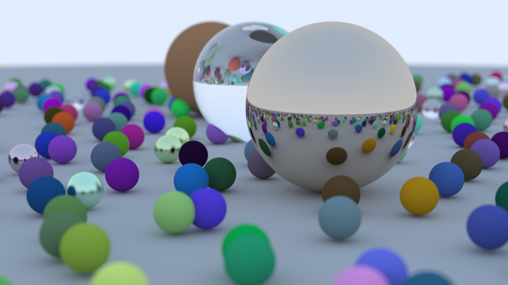

# Basic Ray Tracing

Minimalistic renderer that demonstrates ray tracing concepts to generate visually realistic images by simulating the physics of light.

This project is implemented in modern C++ 20 and uses custom-built classes to perform lighting, reflections, refractions, shadows, and depth of field effects.

---

## Features

- **3D Ray Tracing**:
    - Simulation of light interaction with 3D surfaces.
    - Support for reflections, refractions, and shadows.

- **Camera Controls**:
    - Adjustable **focus distance** and **defocus angle** for realistic **depth of field** effects.
    - Customizable viewing configurations (`look_from`, `look_at`, `view_up`).

- **Materials**:
    - Support for reflective and refractive materials.
    - Custom material definitions.

- **Pixel Sampling**:
    - Anti-aliasing implemented by sampling multiple rays per pixel.
    - Configurable number of samples for control over quality and performance.

- **Viewport and Geometry**:
    - Supports configurable aspect ratio, field of view, and image resolution.
    - Clean and extensible vector math library (`vec3`) for geometric computations.

---

## Requirements

To build and run this project, you will need:
- **C++20** or later.

---

## Setup and Building

1. Clone the repository:
   ```bash
   git clone <repository-url>
   cd raytracing
   ```

2. Use **CMake** to configure and build the project:
   ```bash
   mkdir build
   cd build
   cmake ..
   make
   ```

3. Once built, run the program:
   ```bash
   ./raytracer > image.ppm
   ```

---

## Configuration

The camera and rendering parameters can be customized in the `camera` class to produce different effects. Key adjustable parameters include:

- **Camera Settings**:
    - `aspect_ratio` - The width-to-height ratio of the output image.
    - `vertical_fov` - The vertical field of view angle in degrees.
    - `look_from` and `look_at` - Set the camera's position and the point it looks at.

- **Focus and Depth of Field**:
    - `focus_distance` - Distance to the focal plane where objects appear sharp.
    - `defocus_angle` - Size of the aperture angle to simulate depth of field blur.

- **Rendering Options**:
    - `image_width`, `samples_per_pixel`, and `max_depth` - Control output resolution, anti-aliasing quality, and recursion depth for light bounces.

---

## Key Components

### 1. Camera
The `camera` class controls the viewport, ray generation, and depth of field effects. Using `focus_distance` and `defocus_angle`, it can simulate a depth of field effect akin to real-world photography.

### 2. Vector Math
The `vec3` class provides core geometric and mathematical calculations for:
- Vector addition, subtraction, multiplication, division, and normalization.
- Reflection, refraction, and random distribution functions for realistic rendering.

### 3. Ray Interaction
The project uses rays (`ray` class) to traverse the scene, detecting intersections with objects, simulating light-material interactions, and producing colors for each pixel.

---

## Example Output

After running the project, it generates an image in PPM format.



---

## Future Enhancements

Planned improvements or extensions for the ray tracer include:
- **Support for triangles** - Extend the existing object support with triangle-based objects
- **Acceleration structures** - Use BVH for faster ray-object intersections.

---

## References and Inspiration

This project is based on the classic concepts of ray tracing introduced by [_Ray Tracing in One Weekend_](https://raytracing.github.io/books/RayTracingInOneWeekend.html) (by Peter Shirley) and further enhanced to include additional functionality and optimizations.

---